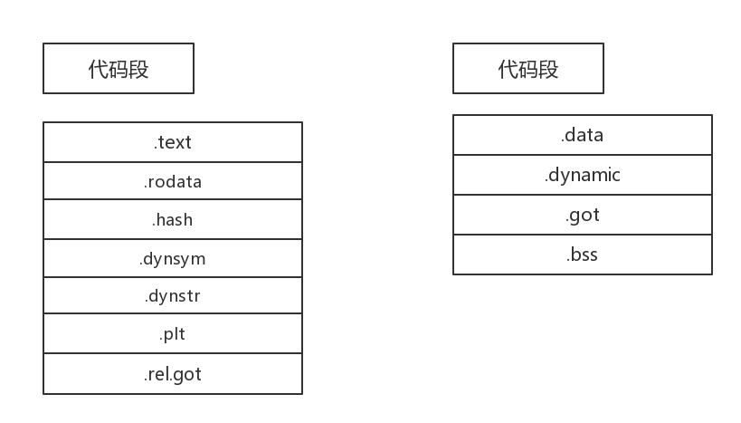

##0.3 ELF和mboot简介

##0.3. 什么是ELF？

ELF 是（Executable and linking Format) "可执行连接格式，最初由UNIX实验室作为应用程序二进制接口的一部分被发布和订阅，最为一种可移植的格式，被TIS应用在基于Inter32位架构的各种操作系统上，它最大的特点是有比较广泛的的适用性，通用的二进制接口可以方便的平滑的移植到多个不同的操作系统上。1999年，被86open项目选为x86架构上的类Unix操作系统的二进制文件标准格式，用来取代COFF。因其可扩展性与灵活性，也可应用在其它处理器、计算机系统架构的操作系统上。这里我们只简单的介绍下，对于ELF其实有很多的优秀资料，这个格式并不是我们的观察重点。

##0.3. ELF的结构
几个重要的概念：

经过编译的程序：可重定位文件，待重定位文件。

ELF：仅仅指链接好的可执行文件也称为目标文件。

ELF文件主要分为以下的三个类型：
1.可重定位文件，与其它目标文件进行链接构成可执行文件，或者为动态链接文件。

2.共享目标文件，动态链接库文件。

3.可执行文件，经过链接的可以执行的程序文件。


###静态结构

基本结构：


数据表示：ELF有自己定一的一套数据类型，不需要依靠目标机器。

ELF 文件头：

```
typedef struct {
      unsigned char       e_ident[EI_NIDENT];   /*ELF文件标识*/
      Elf32_Half          e_type;               /*本目标文件属于哪一种类型*/
      Elf32_Half          e_machine;            /*此字段用于指定的处理器结构*/
      Elf32_Word          e_version;            /*本目标文件的版本*/
      Elf32_Addr          e_entry;              /*程序入口虚拟地址*/
      Elf32_Off           e_phoff;              /*程序头表的偏移量*/
      Elf32_Off           e_shoff;              /*节头表处于文件中的偏移量*/
      Elf32_Word          e_flags;              /*含有处理器特定的标志*/
      Elf32_Half          e_ehsize;             /*ELF头文件的大小*/
      Elf32_Half          e_phentsize;          /*程序头表在每一表项的大小*/
      Elf32_Half          e_phnum;              /*程序头表中总共有多少项*/
      Elf32_Half          e_shentsize;          /*节头表每一个项的大小*/
      Elf32_Half          e_shnum;              /*节头表有多少表项*/
      Elf32_Half          e_shstrndx;           /*节头表中与节名表相对应的索引*/
} Elf32_Ehdr;


```
节：
在目标文件中可以包含很多的节，所有的这些“节”都登记在一张称为“节头表”的数组里。节头表每一个表项是一个ELF32_shdr结构，通过每一个表项可以定位到对应的节。

特殊节：
在ELF文件中有一些特定的节是预定义好的，其内容是指令代码或者通信，这些节专门为了特殊的操作系统使用，对于不同的操作系统，这些节的类型和属性有所不同。

字符串表：
字符串表中包含若干以NULL为结尾的字符序列。

符号表：目标文件中“符号表”所包含的信息用于定位和重新定位程序中的符号定义和引用，目标文件的其它部分通过一个符号在这个表中的索引值来使用该符号，索引值从0开始计数。

重定位：把符号引用与符号定义链接在一起的过程。重定位是连接符号引用和符号定义的过程。比如，当一个程序调用一个函数的时候，
相关的调用必须在执行时把控制传送到正确的目标地址。换句话说，重定位文件应当
包含有如何修改他们的 section 内容的信息，从而允许可执行文件或共享目标文件
为一个进程的程序映像保存正确的信息。重定位入口就是这样的数据。
```
  typedef struct {
      Elf32_Addr r_offset;
      Elf32_Word r_info;
  } Elf32_Rel;
  typedef struct {
      Elf32_Addr r_offset;
      Elf32_Word r_info;
      Elf32_Sword r_addend;
  } Elf32_Rela;
```
* r_offset
  该成员给出了应用重定位行为的地址。
* r_info
  该成员给出了具有受重定位影响因素的符号表索引和重定位应用的类型。
* r_addend
  该成员指定一个常量加数（用于计算将要存储于重定位域中的值）。
 
* 在可重定位文件中，r_offset 表示了一个 section 偏移。
  
* 在可执行和共享的目标文件中，r_offset 表示一个虚拟地址。


###动态结构

程序头结构：每一个称许头存储的一个段的信息。

```
 typedef struct {
      Elf32_Word p_type;    /* 该成员指出了这个数组的元素描述了什么类型的段，或怎样解释该数组元素的信息。*/
      Elf32_Off p_offset;   /* 该成员给出了该段的驻留位置相对于文件开始处的偏移。*/
      Elf32_Addr p_vaddr;   /* 该成员给出了该段在内存中的首字节地址*/
      Elf32_Addr p_paddr;   /* 在物理地址定位有关联的系统中，该成员是为该段的物理地址而保留的。*/
      Elf32_Word p_filesz;  /* 该成员给出了文件映像中该段的字节数；它可能是 0 。*/
      Elf32_Word p_memsz;   /* 该成员给出了内存映像中该段的字节数；它可能是 0 。*/
      Elf32_Word p_flags;   /* 该成员给出了和该段相关的标志。定义的标志值如下所述。*/
      Elf32_Word p_align;   /* 就象在后面“载入程序”部分中所说的那样，可载入的进程段必须有合适的
                               p_vaddr 、 p_offset 值，取页面大小的模。*/
} Elf32_Phdr;

```
段内容与数据内容：


###可执行文件的解析
原则上我们可以使用 objdump , readelf ,nm  对照ELF的格式完全解析的，但是这里并不是重点，并且有人为我们做过这个工作了。

###0.3.什么是mboot?
mboot 就是我们之前说过的启动规范，启动规范的具体细节我们在第十一章节详细讨论，并且我们简要介绍的ELF，其实都是有联系的，我们的内核其实编译完成以后就是ELF格式，我们在运行我们的系统时，难免有错误或者失败的情况，我们将这些细节实现之后然后将内核保存于一个ELF结构体内，当有错误时，我们就可以看到内核的调用流程，个人感觉使用GDB更加方便。

###参考资料
[1]ELF格式解析  --基于ELF规范v1.2版本 赵凤阳 2009