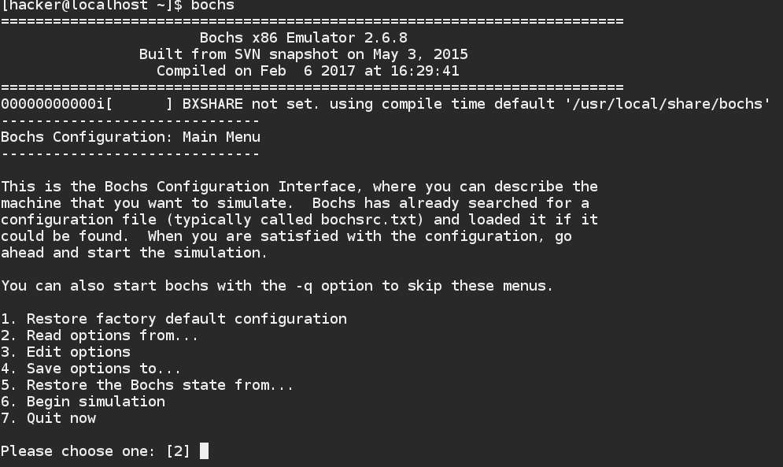

#第十一章 系统启动

##11.3 Bochs 安装与配置

##Bochs 是什么？

>Bochs is a highly portable open source IA-32 (x86) PC emulator written in C++, that runs on most popular platforms. It includes emulation of the Intel x86 CPU, common I/O devices, and a custom BIOS. Bochs can be compiled to emulate many different x86 CPUs, from early 386 to the most recent x86-64 Intel and AMD processors which may even not reached the market yet.

>Bochs是一种高度可移植使用C++编写用来模拟IA-32架构的虚拟软件，它运行在几乎所有主流平台。它包括英特尔X86 CPU的仿真，常用的IO 设备，和自定义的BIOS。并且它可以编译模仿很多不同架构的X86处理器。从最早的386芯片，以及最近的X86——64芯片，以及AMD的处理器甚至市场上还没有广泛使用的芯片。

>Bochs is capable of running most Operating Systems inside the emulation including Linux, DOS or Microsoft Windows. Bochs was originally written by Kevin Lawton and is currently maintained by this project.
    
>    Bochs can be compiled and used in a variety of modes, some which are still in development. The 'typical' use of bochs is to provide complete x86 PC emulation, including the x86 processor, hardware devices, and memory. This allows you to run OS's and software within the emulator on your workstation, much like you have a machine inside of a machine. For instance, let's say your workstation is a Unix/X11 workstation, but you want to run Win'95 applications. Bochs will allow you to run Win 95 and associated software on your Unix/X11 workstation, displaying a window on your workstation, simulating a monitor on a PC.

>Bochs 能够运行仿真大多数的操作系统，包括Linux DOS 或者是WINODS 。Bochs 最初是由kevin Lawton 编写并且现在由本项目维护。

>Bochs 可以编译和使用在多种模式下，一些仍然在开发中，它经典的使用方式是用来模拟X86PC ，包括处理器和硬件设备，内存。它允许你运行其他操作系统在你的工作站上，就是虚拟机。例如你的工作站是UNIX/X11 但是你想要运行WIN95的应用程序，它可以模拟运行你的WIN95程序并且在PC上监控它。

##为什么使用Bochs?

在操作系统仿真上一般使用两个虚拟软件使用的比较多，一个是Bochs 另一个就是qemu.VMware几乎很少使用。qemu使用简单，只能使用GDB远程调试。Bochs 是GUI界面可以使用自带的GDB调试也可以远程调试，并且配置参数更多，功能更多。很多功能有直观的显示，使用上是更加的方便。并且带有日志功能，使用qemu时总是苦于没有日志调试，导致很多问题不能精准的定位。所以个人推荐使用Bochs.

##Bochs的使用

###Bochs 的安装

1.软件源安装

>yum install bochs.x86_64

2.源码安装

>从官网下载源代码 https://sourceforge.net/projects/bochs/

>tar zxvf bochs.gz

>./configure --enable-debugger   使用自带调试

>--prefix=/your_path             设置安装目录

>--enable-disasm                 设置允许反汇编

>--enable-iodebug                设置允许IO调试

>--enable-x86-debugger           设置允许X86调试


>--with-x                        设置使用X windos

>--with-x11                      设置X11图形接口


注意要点：
       还需要几个必须预先安装的库libcx11-dev ; xorg-dev ;libxrander;g++
       
./configure make  make install
       
安装完成后如图：



       
       
###Bochs 的配置

Bochs 需要我们根据自己的需求编写配置文件，其中主要有以下的几个基础配置选项。
默认是配置文件名叫bochsrc  bochsrc.txt

```
#Configuration file for bochs
#内存大小设置以MB 为单位
megs: 32    
#镜像以及VGA模式设置，需要根据自己的安装路径设置
romimage: file=/home/hacker/bochs/share/bochs/BIOS-bochs-latest
vgaromimage: file=/home/hacker/bochs/share/bochs/VGABIOS-lgpl-latest
#floppya:1_44=a.img,status=inserted
#启动方式我们选择的是硬盘启动
boot: disk
#日志名称
log: bochs.out
#鼠标开关，此处为关闭
mouse: enabled=0
#键盘配置信息，影射表Bochs很多可以选择适合的
keyboard: keymap=/home/hacker/bochs/share/bochs/keymaps/x11-pc-us.map
#硬盘信息固定共有四块ata0 ~ ata3
ata0: enabled=1, ioaddr1=0x1f0, ioaddr2=0x3f0, irq=14
#硬盘详细信息 类型 名称 类型
ata0-master: type=disk, path="hd60M.img", mode=flat 
#GDB 远程调试可选
#gdbstub: enabled=1, port=1234, text_base=0, data_base=0, bss_base=0

```
###Bichs 操作命令
c:进入目标系统

ctrl+c：返回调试状态

常用命令

|命令|功能|
|：-----------|：----------|
|c/count|向下执行
|s/step|单步执行
|N/next|单步执行
|Vb/vbreak[seg:off]|在虚拟地址上设置断点
|Lb/lbreak[addr]|在线性地址上设置断点
|Pb/pbreak/b/break[addr]|在物理地址上设置断点
|Blist|显示断点状态
|x[addr]|显示线性地址
|setpmem[addr][val]|设置物理内存中内容
|Dump_cpu|显示CPU 信息
|Disassemble[/num][start][end]|反汇编区域代码
|info cpu|显示所有CPU 寄存器值
|info idt num|显示第NUM项IDT
|info gdt num|显示第num项GDT
|info cr|显示CR 系列寄存器


