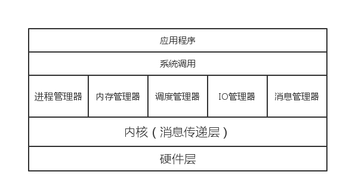

#3.1操作系统体系结构概述

计算机的落脚点最终一定是“计算”二字，计算机科学可以说就是计算的科学，计算机只是我们实现计算过程的工具。纵观人类科学与技术的发展，人脑在这个过程中始终在做“归纳”，“推理”，“证明”等逻辑活动并且借助数学发展出了很多公理，定理，推论，系统，甚至还有很多猜想。我们不难发现，人脑非常善于抽象，善于分析，善于联系。但是并不善于计算活动。

计算机正是为了帮助我们计算而诞生的。现代计算机总体而言是采用了冯诺伊曼体系结构，几乎所有计算机都采取了这种硬件体系结构。软件其实独立于计算机硬件，是一种逻辑产物，本质上是我们告诉计算机的计算过程，只不过由计算机待劳，完成计算的出结果。

我们这里讨论的操作系统就是软件，操作系统算是最复杂的软件之一。操作系统反映的是对于计算机硬件资源的管理，对应用程序调控，相当于我们赋予了计算机一套运作的最基本法则，而操作系统就是这个法则的载体，是这个法则的具体化。操作系统不但需要的是设计者的思想也受制于现代计算机的体系结构。

#Parallex体系结构概述

任何一个系统都应该由一个抽象的体系结构，这个体系结构对于一个具体化的系统具有指导意义。操作系统也不能例外。

##Parallex体系结构

Parallex 采用“微内核”的概念，做出如下结构：

分层结构的目的就是抽象与封装低一层的细节，为其上层提供接口，我们的设计依然也采用这样的一种结构，真各个体系结构由硬件层，内核层（消息传递层），核心系统层，应用程序层组成。

硬件层是对计算机硬件的集合的描述，和最普通概念一致，就是硬件的组成。

###内核层

内核层采用“微内核”结构，总体而言就是一个灵活的消息传递系统，它采用了“微内核”但是并没有采用其“聚合”的实现方式，而是采用了灵活的消息队列的处理方式，这样的优点是消息传递灵活，对于实现具体需求甚至是订制系
统提供了坚实友好的基础，缺点是较为复杂。著名的MINIX就是因为其复杂而使用了教为简单的“聚合”方式。

核心系统层是系统的重要组成部分，是对资源管理的具体化。下面我们分开具体的阐述各个子系统：

###进程管理器

负责进程的创建，每当有一个创建进程的需求时，进测管理器首先接收到消息，接下来由它来负责向其它管理器发送资源获取消息，开始组装一个进程。

###内存管理器

内存作为现代计算机一种极为特殊的资源，我们需要使用专门的系统来管理内存资源，内存管理器主要承担物理内存，虚拟内存，交换空间的管理。为进程提供载体。

###调度管理器

调度管理器是对CPU的抽象，现代计算机早已经进入了多核的时代，所以进程的调度就需要一个专门的调度器来实现不同的处理器模块不同的进程调度处理。

###IO管理器

我们这里专门抽象出了IO管理器，IO在为未来比将以多元，多样的形式出现，传统计算机的输入输出虽不会被替代，但是必须支持多样的输入输出设备将是大势所趋。所以我们将IO作为独立的模块。

###消息管理器

计算机单机的能力有限，不能使用共享资源，互联网的出现改变了这样的情况，整个世界被互连网联系在一起，真正是实现了资源共享，所以对于消息的管理我们不再仅仅只是停留在单机系统模块之间，更应当着眼于网络间通信。

