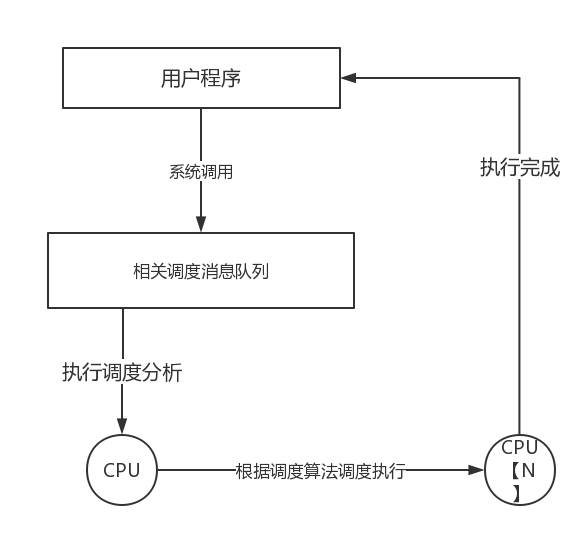

###2.2 内核提供的服务

内核是操作系统的核心，是操作系统管理一切硬件，软件规则的核心。简而言之，内核就是计算机的心智。和传统的内核一样，我们的内核也分内核态和用户态，内核态与用户态其实我们为了便于理解所定义的状态，其实本质上是因为CPU的特权级问题，我们的CPU以80386为例，它总共有4个权限模式，本质上是对指令的限制，这四个模式就是0，1，2，3模式，数值越小权限越高。一般情况下，内核就在0特权下运行的，拥有最高的权限，“能力越大责任就越大”，内核自然肩负这最为重要的任务，就是为用户提供高效，合理，稳定，方便的服务。

内核在这里提供的服务主要是管理硬件，软件资源，提高系统运行效率，方便用户使用。

具体来说，我们的内核首先就是接受用户的请求帮助用户完成任务，具体就是识别用户程序发出的消息，做出合理的调度。和众多类UNIX系统相似，我们也是通过系统调用来使用内核来帮助用户做一些更复杂的事情。特别值的提的一件事，我们虽然使用了消息传递的方式但是却并不仅仅将消息收发作为唯一的系统调用，没有像MINIX那样将内存，进程，IO等模块放在用户空间，内核之简单做消息传递工作，这也是“微内核”三个字中“微”的含义。我们和LINUX内核相似将所有的和系统相关的模块还是放在内核态，但是核LINUX不同的是我们使用消息传递来解决多模块之间耦合性高的问题。并且希望使用这种方式来发挥多核的威力。

我们以一张简明的图来总结：

