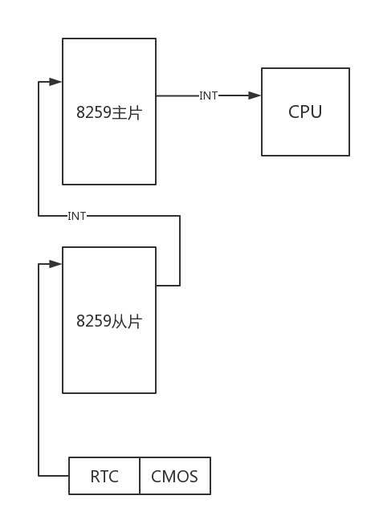
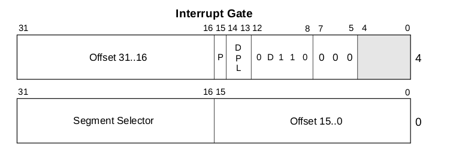
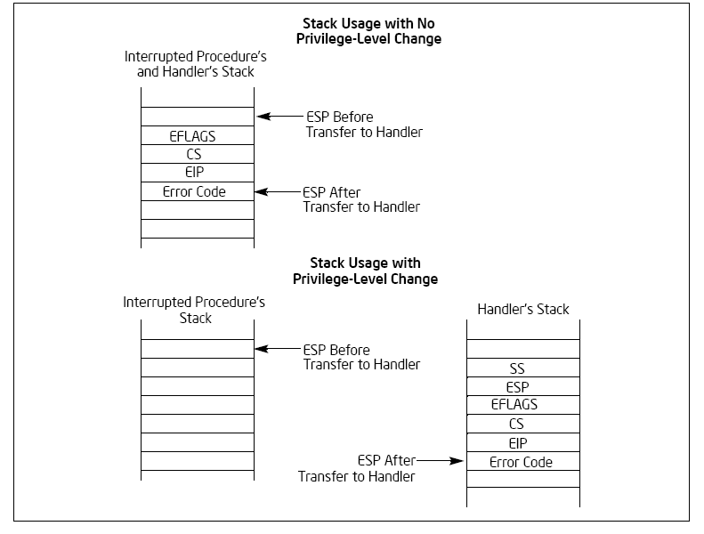
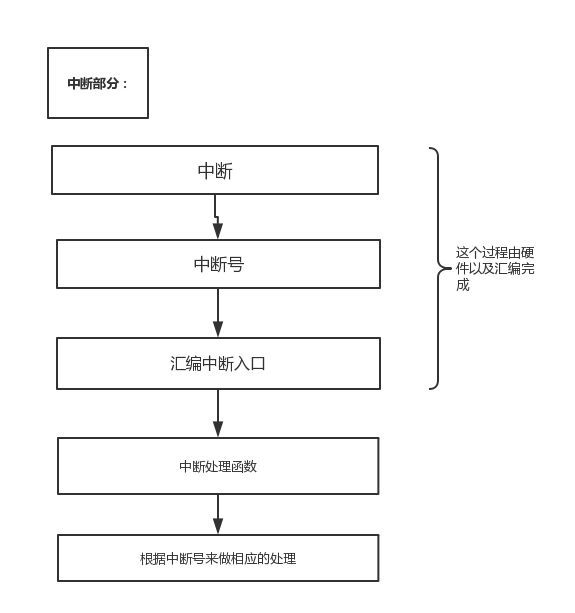

#3.x ParalleX  异常与中断

##中断的感性认识

在过去的时候，我指的20世纪中期，那个时候计算机非常昂贵，大家都想使用计算机的计算资源，为了分享计算机的计算资源，人们为了提供多用户多任务的功能，发明了一种新的机制，“中断机制”。中断就是在一定的时机下，打断计算机的正在执行的程序，调度另一个程序上CPU来执行，在一定时机后又会调度其它的程序运行或者返回之前的执行流程。以此来达到“多用户，多任务”的目的。后来这种机制就成为了处理器必备的机制，我也曾看到一种说法是：“操作系统就是中断驱动的”。

举个例子来讲，你正在写代码，但是你的朋友给你打电话了，这时候你就会暂停手上的工作起身去接电话，这就是发生了一次中断。接电话的任务打断了写代码的任务，发生了一次中断。

##中断的分类与解释

中断的实现是将相应电信号通过中断线发送给CPU，CPU的中断管脚并非只有一根，其实是有NMI和INTR两个管脚，因为从严重性上来看，中断是分为两类的，首先NMI管脚触发的中断是需要无条件立即处理的，这种类型的中断是不会被阻塞和屏蔽的，所以叫做非屏蔽中断（Non Maskable Interrupt，NMI）。事实上一旦产生了NMI中断，就意味着CPU遇到了不可挽回的错误，一般不会进行处理，只是给出一个错误信息。而我们之前所说的中断控制器连接的管脚叫做INTR，这类中断有两个特点，分别是数量多和可屏蔽。而我们主要关注的正是INTR中断。

中断分类为：

1.非屏蔽中断
Intel处理器规定，NMI中断信号由0跳变到1后，至少需要4个时钟周期才能被识别，每一种中断都被编上了号，称为中断类型号，中断向量号或者中断号，不可屏蔽中断一旦发生就是致命的，几乎很难自行修复，所以在实模式下，NMI统一被编号为2，不再进行细分，一单发生这种中断硬件和软件也不会尝试去做出努力，结束掉这个任务是一个不错的选择。

2.可屏蔽中断
和NMI不同，中断并不是意味着死亡与结束，我们可以将它做成有利于我们使用的东西，中断也是抢占的必要条件之一，我们当然也可以选择忽略中断。例如一个进程本来阻塞在读写IO的操作上，当读写操作完成以后，它又可以被运行了，由磁盘控制向CPU发送一个IO中断，当CPU收到这个中断时它就清楚了该将读写动作完成的进程调度上CPU运行了。以设备发出中断来举例的话，计算机的外设是很多的，我们如何做到分清并且处理好外设发生的中断呢。我们就需要使用8259芯片了（可编程中断控制器）。一张简单结构图：

3.内部中断
内部中断发生在处理器内部，是由执行的指令引起的，内部中断并不受IF位的影响，他们的中断类型式固定的，可以立即转入相应的处理程序。

4.软中断
软中断是由int指令引起的中断处理，这类中断也不需要识别中断周期，中断号在指令中给出。int的指令格式如下：
> int3
> int imm8
> into

int3是断点指令，这条指令在调试的时候很有用。
int num 是执行相应中断号的程序。
into 是检测缓冲区溢出的指令。

中断控制器结构由两个8259芯片级联，Inter处理器允许256个中断，范围是0～255，8259芯片只有8个中断输入引脚，个人计算机需要2块，总共可以处理15个中断信号，其中在8259芯片内部还有一个中断屏蔽寄存器IMR，是一个8位的寄存器，这个寄存器对应八个端口，0表示可以将中断送进CPU而1表示不可以，并且我们还需要看CPU的中断位是否设置位1.

##实模式下中断向量表

我们如果接收到了中断处理信息，如何处理这个信息，我们需要借助中断向量表来处理，我们的中断处理程序都加载在内存当中。我们只需要找到相应的程序地址然后执行就可以了。
在实模式下中断向量表有固定的位置，以BIOS为例我们可以看到BIOS的中断处理程序地址在地址0x00000开始整齐排列。一共256个中断，每一个中断由段地址：偏移地址组成一共占用1KB内存大小。

处理器在接到中断处理信号时需要做如下的事情：

1.保护断点现场。

2.执行中断处理程序。

3.返回到断点继续执行。

##保护模式下中断向量表

我们知道中断分为外部设备的硬中断，和CPU内部的软中断。这两种中断的区别是硬件中断完全是随机产生的，与处理器的执行步骤并不相同。当中断发生时，处理器需要先执行完当前的指令，然后才能对中断进行处理，软中断是由int n 指令引发的中断处理，n 是中断号或者叫类型码。

在保护模式下，处理器对于中断管理是相似的，但是并非使用传统的中断向量表，而是使用中断描述符表（IDT）。
包括16位的目标代码段选择子，以及32位的偏移量。中断们只能在IDT内，任务门可以位与GDT，LDT，IDT中。IDT和中断向量表不同，不需要在内存的最低端，有一个48位的中断描述符表寄存器IDTR用来存储中断描述符表的基地址。

中断描述符表的大小可以达到64KB但是CPU只能识别256个中断，所以其实最多只用2KB的大小，其它空余槽位清为0.其中IDT的第一个描述符也是有用的。

在发生中断时CPU具体处理方式：

1.根据处理程序的级别，从当前的任务TSS中取出栈段选择子，栈指针，处理器把旧的栈的选择子和栈指针压入新栈。

2.处理器把EFLAGS，CS，EIP 的当前状态压入新栈。

3.对于有错误代码和异常，处理器还要把错误代码压入新栈，紧紧在EIP后。

1.如果中段处理程序的特权级别和当前特权级别一致，则不会转换栈。

2.处理器把当前的EFLAGS，CS和EIP的当前状态压入当前栈。

3.对于有错误代码和异常，处理器还要把错误代码压入新栈，紧紧在EIP后。

##异常

异常就是我们上文之前说过的内部中断。他们是处理器内部产生的中断，表示遇到了非法的操作，例如除0或者TSS无效等等。

异常的分类：

第一种：程序错误引发的异常。

第二种：软件引发的异常。

第三种：机器检查引发的异常。

按照异常的严重程度我们又可以分为以下三种：

第一种：故障，一般可以纠正，例如缺页这也是虚拟内存必须的一个条件。

第二种：陷阱，一般可以用于调试和调用。

第三种：终止，严重错误终止任务，例如双重错误。

|向量号 |助记符 |  说明    |            类型  |   错误号 |    产生源|
|:------|:------|:-----------|:---------------|:----------|:---------|
|0     |#DE    |除出错               | 故障      |无      | DIV或IDIV指令
|1     |#DB    |调试                |           |无     |  
|2     | --   |NMI中断              | 中断      |无     | 非屏蔽外部中断
|3     |#BP    |断点                | 陷阱      |无      | INT 3指令
|4     |#OF    |溢出                | 陷阱      |无      | INTO指令
|5     |#BR  |边界范围超出             |故障     |无      |  BOUND指令
|6     |#UD  |无效操作码（未定义操作码） |故障     |无      | UD2指令或保留的操作码。（Pentium Pro中加入的新指令）
|7     |#NM   |设备不存在（无数学协处理器）|故障   | 无      | 浮点或WAIT/FWAIT指令
|8     |#DF   |双重错误               | 终止  |有（0）   |任何可产生异常、NMI或INTR的指令
|9     |--    |协处理器段超越（保留）  | 故障    |  无      |   浮点指令（386以后的CPU不产生该异常）
|10    |#TS   | 无效的任务状态段TSS   | 故障     | 有     |  任务交换或访问TSS
|11    |#NP   |段不存在              | 故障    |有        |  加载段寄存器或访问系统段
|12    |#SS   |堆栈段错误            | 故障     | 有      |   堆栈操作和SS寄存器加载
|13    |#GP   |一般保护错误          | 故障     | 有      |任何内存引用和其他保护检查
|14    |#PF   |页面错误             | 故障      |有       |  任何内存引用
|15    |-- |（Intel保留，请勿使用）    |       | 无|
|16    |#MF |x87 FPU浮点错误（数学错误）|故障    |无       | x87 FPU浮点或WAIT/FWAIT指令
|17    |#AC | 对起检查                | 故障  |有（0）   | 对内存中任何数据的引用
|18    |#MC  |机器检查               | 终止  | 无       | 错误码（若有）和产生源与CPU类型有关（奔腾处理器引进）
|19    |#XF  |SIMD浮点异常          |故障     |无       | SSE和SSE2浮点指令（PIII处理器引进）
|20-31 |-- |（Intel保留，请勿使用）|||
|32-255 |-- |用户定义（非保留）中断   |中断     |         |  外部中断或者INT n指令

###设置中断

我们的重点是保护模式下的中断处理。中断处理程序是运行在ring0层的，这就意味着中断处理程序拥有着系统的全部权限，仿照内存段描述符表的思路，Intel设置了一个叫做中断描述符表（IDT, Interrupt Descriptor Table）的东西，和段描述符表一样放置在主存中，类似地，也有一个中断描述符表寄存器（IDTR）记录这个表的起始地址。那么下文的重点就是这个中断描述符的结构和设置方法了，其实这里很类似GDT的那一套过程.中断描述符在上文已经给出了。

之前我们建立了中断的概念并且介绍了描述符表的结构，接下来我们细化CPU处理中断的过程，首先是起始过程，也就是从CPU发现中断事件后，打断当前程序或任务的执行，根据某种机制跳转到中断处理函数去执行的过程：

CPU在执行完当前程序的每一条指令后，都会去确认在执行刚才的指令过程中是否发送中断请求过来，如果有那么CPU就会在相应的时钟脉冲到来时从总线上读取中断请求对应的中断向量。然后根据得到的中断向量为索引到IDT中找到该向量对应的中断描述符，中断描述符里保存着中断处理函数的段选择子；

CPU使用IDT查到的中断处理函数段选择子从GDT中取得相应的段描述符，段描述符里保存了中断处理函数的段基址和属性信息。此时CPU要进行一个很关键的特权检验的过程，这个涉及到CPL、RPL和DPL的数值检验以及判断是否发生用户态到内核态的切换。如果发生了切换，还要涉及到TSS段和用户栈和内核栈的切换；4

确认无误后CPU开始保存当前被打断的程序的现场(即一些寄存器的值)，以便于将来恢复被打断的程序继续执行。这需要利用内核栈来保存相关现场信息，即依次压入当前被打断程序使用的eflags、cs、eip、以及错误代码号（如果当前中断有错误代码）；

最后CPU会从中断描述符中取出中断处理函数的起始地址并跳转过去执行。

以上是起始过程，中断处理函数执行完成之后需要通过iret或iretd指令恢复被打断的程序的执行。这时候比较简单，首先CPU会从内核栈里弹出先前保存的被打断的程序的现场信息，即之前的eflags，cs，eip重新开始被打断前的任务。5

需要注意的是：如果此次处理的是带有错误码的中断，CPU在恢复先前程序的现场时，并不会弹出错误代码。这一步需要通过软件完成，即要求相关的中断处理函数在使用iret指令返回之前添加出栈代码主动弹出错误代码。

总结起来的步骤就是：

step1: 设置中断向量表desc[256]
step2: 初始化中断向量表并且设置lgdtr 寄存器
step3: 打开中断

