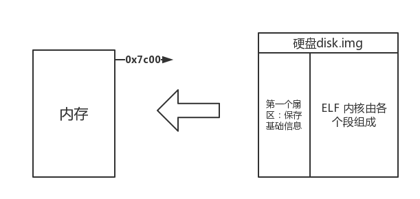

#第三章 内核服务

##3.3 bootloader加载

###要点：
####1. 实模式 
####2. 保护模式
####3. 从实模式到保护模式
####4. 从硬盘读取内核到内存

###实模式（RealMode）--16位
实模式就是在《微机原理》课程中学过的8086CPU的编程模式，最主要特征就是寻址方式为真实地址寻址，CPU复位（reset）或加电（power on）的时候以实模式启动，处理器以实模式工作。在实模式下，内存寻址方式和8086相同，由16位段寄存器的内容乘以16（10H）当做段基地址，加上16位偏移地址形成20位的物理地址，最大寻址空间1MB，最大分段64KB。可以使用32位指令。32位的x86 CPU用做高速的8086。在实模式下，所有的段都是可以读、写和可执行的。
286架构导入保护模式，允许硬件等级的存储器保护。然而要使用这些新的特色，需要额外先前不需要的软件指令。由于x86微处理机主要的设计规格，是能够完全地向前兼容于针对先前所有x86芯片所撰写的软件，因此286芯片的开机是处于'实模式'—也就是关闭新的存储器保护特性的模式，所以可以运行针对旧的微处理器所设计的软件。到现在为止，即使最新的x86 CPU一开始在电源打开处于实模式下，也能够运行针对先前任何芯片所撰写的软件。

###保护模式(Protected Mode)--32位
保护模式，是一种80286系列和之后的x86兼容CPU操作模式。保护模式有一些新的特色，设计用来增强多工和系统稳定度，像是 内存保护，分页 系统，以及硬件支援的 虚拟内存。大部分的现今 x86 操作系统 都在保护模式下运行，包含 Linux、FreeBSD、以及 微软 Windows 2.0 和之后版本。
另外一种286和其之后CPU的运行模式是实模式，一种向前兼容且关闭了保护模式这些特性的CPU运行模式。用来让新的芯片可以运行旧的软件。依照设计的规格，所有的x86 CPU都是在实模式下开机，来确保传统操作系统的向前兼容性。在任何保护模式的特性可用前，他们必须要由某些程序手动地切换到保护模式。在现今的计算机，这种切换通常是由操作系统在开机时候必须完成的第一件任务的一个。它也可能当CPU在保护模式下运行时，使用虚拟86模式来运行设计运行在实模式下的代码。

###虚拟8086模式(Virtual 8086Mode)

>The most common problem with v86 mode is that you can't enter Protected mode from inside of a v86 task. In other words, if you are running Windows or have emm386 in memory, you can't do a "raw" switch into protected mode (it causes an exception). DOS extenders worked around that problem using either VCPI or DPMI interfaces to switch into pmode (actually, promoting their V86 task as a 'regular' user task). For an OS programmer such interfaces are simply useless as they're part of another OS.
>There are a few other more "technical" problems people have when using v86 mode, mostly because v86 has some instructions "emulated" by what's known as a v86-monitor program, as the CPU is in protected mode, some instructions are high up on the security/protection level and running those directly would cause no-end of trouble for the OS.

最常见的问题在V86模式中，你不能从虚拟86模式进入保护模式，换句话说，如果你运行的是WINDOS或者EMM386系统在系统上，你将不能切换进保护模式，这将引起一个异常，DOS的扩展可以围绕这个问题VCPI或者DPMI接口切换到保护模式。

###长模式--64位(Long Mode)

>Long mode extends general registers to 64 bits (RAX, RBX, RIP, RSP, RFLAGS, etc), and adds eight additional integer registers (R8, R9, ..., R15) plus eight more SSE registers (XMM8 to XMM15) to the CPU. Linear addresses are extended to 64 bit (however, a given CPU may implement less than this) and the physical address space is extended to 52 bits (a given CPU may implement less than this). In essence long mode adds another mode to the CPU.
>Long mode does not support hardware task switching or virtual 8086 tasks. In long mode the current CS determines if the code currently running is 64 bit code (true long mode) or 32 bit code (compatibility mode), or even 16-bit protected mode code (still in compatibility mode). Using paging has become mandatory, and segmentation has been stripped down for performance reasons.
>The first 64 bit CPUs from both Intel and AMD support 40 bit physical addresses and 48 bit linear addresses.

在长模式中扩展了通用寄存器RAX RBX RIP RSP rflags 并增加了八个额外的整数寄存器（R8 ～ R15）和 8个SSE寄存器（Xmm8 到
Xmm15)的CPU 。线性地址扩展到64位（但是真实的CPU实现是要小于此）并且物理地址扩展到52位（CPU的实现可能小于此）本质上长模式是增加的另一种模式。

###从实模式切换到保护模式
细节请参见《X86_64从实模式到保护模式》 主要就是讲解了Inter的i386芯片。
我们这里来小结进入保护模式的几个必要条件：
设置LGDT，设置段描述符。

打开A20地址线。

清空CPU流水线。

设置PE标志位。

代码跳转到目标执行位置。

###A20地址线问题

A20 就是第21根地址线，在8086CPU上只有20位地址线，到286的时代有24位地址线为了在286的机器上运行8086的程序，所以就将第21根地址线恒置为0.这样地址空间为20位。为了解决这个问题，IBM公司使用一个与门来控制第21根地址线，并把控制阀门放在键盘控制器内，端口号是0x60. 只需要将60端口写1，但是由于是和键盘挂钩，必须先判断键盘此时是否可用。在本系统中模拟的是I386系统，所以也是采用这种麻烦的方式，但是在486芯片中，英特尔和IBM 给处理器加上了A20屏蔽引脚，并设计端口0x92为1可以直接设置A20地址线。后来也叫fast A20 .先从该端口读出原数据，接着将第2位设置为1，然后再写该端口，这样就打开了A20.

###从硬盘读取内核到内存
首先，明确几个条件：

我们的内核是已经编译链接完成的二进制ELF——386文件。我们的目的是将此二进制文件加载进内存条，内存的起始地址为0x7C00,首先读取磁盘的一个扇区，读取关键信息，判断是不是ELF文件然后继续读取ELF中的每一个段。读取完毕后，进入程序的入口。

####从端口读数据的方法

类似于我们学习过的8086汇编希望从硬盘读数据必须要发送磁头号，柱面号和扇区号。后在采用逻辑扇区之后，我们仅仅需要使用扇区号就可以了。最早的扇区管理方式是LBA28，使用28位比特来发送逻辑扇区号，每个扇区512字节，总共可以管理128GB的空间。现在已经使用LBA48可以管理131072TB 的磁盘容量了。现在PC上主硬盘控制器已经被分配了8位端口，端口从0x1f0到0x1f7.

固定步骤：

step1:设置读取的扇区数量，端口（0x1f2）

step2:设置起始的LBA扇区号，28位端口太长所以我们需要分成4段，分别写入端口 0x1f3 0x1f4 0x1f5 0x1f6 一共四个端口28位。

step3:向端口0x1f7写入0x20 请求工作。

step4:等待读写完成

step5:从端口0x1f0处读出数据

其中我们内核的每一个段都给与512字节也就是一个扇区整数倍的空间大小。

####加载过程

