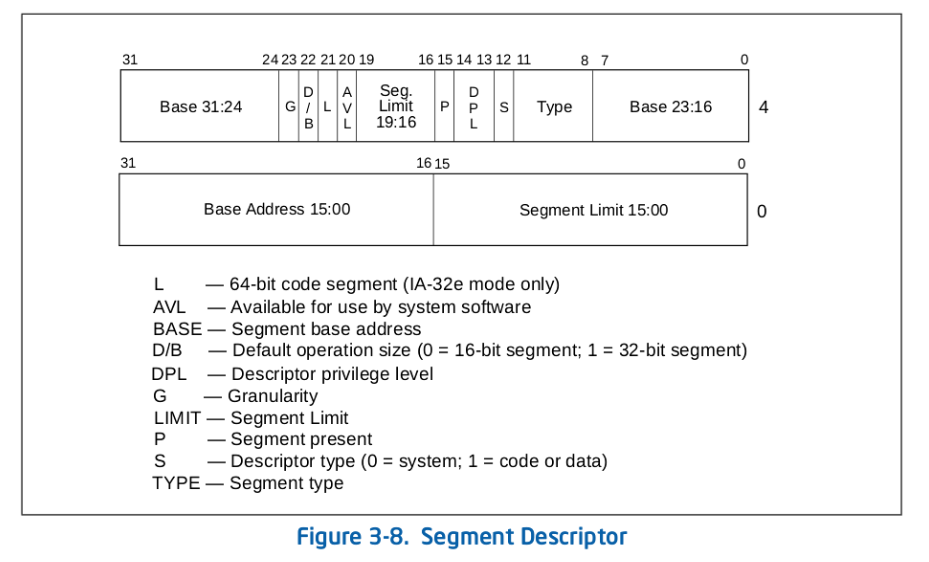
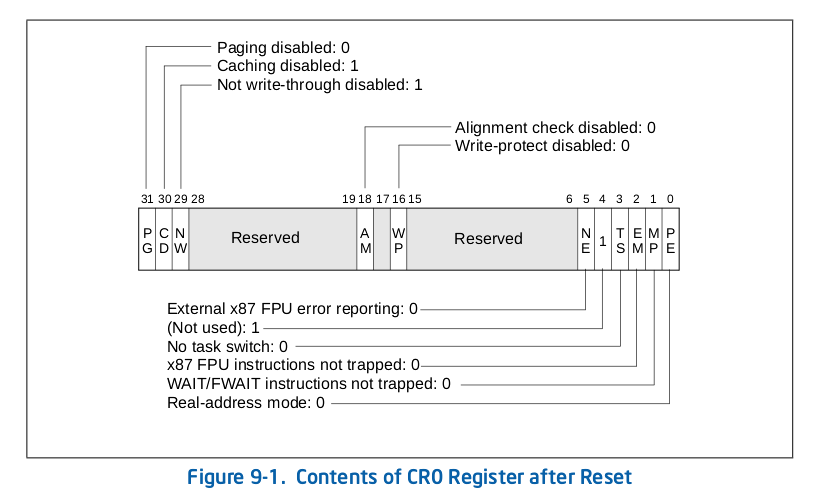
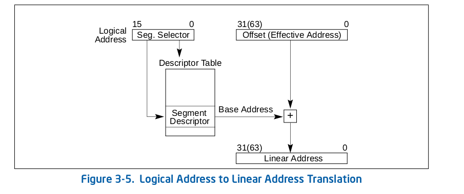

#Parallex_全局段描述符

###保护模式的引入
模式指的是8086CPU的运行模式，不过这是后来提出的概念，在8086时代只有当时的运行模式，自然也就没有“实模式”这么个提法。8086的汇编中，我们对于实模式的各种机制应该算是比较了解了，其大致包括实模式1MB的线性地址空间、内存寻址方法、寄存器、端口读写以及中断处理方法等内容。

不过到了80386时代，引进了一种沿用至今的CPU运行机制——保护模式(Protected Mode)。保护模式有一些新的特色，用来增强多工和系统稳定度，比如内存保护，分页系统，以及硬件支持的虚拟内存等。大部分现今基于x86架构的操作系统都在保护模式下运行，包括Linux、FreeBSD、以及微软Windows 2.0和之后版本（都指32位操作系统） 。

保护模式里80386首先扩展了8086的处理器，原先的AX，BX，CX，DX，SI，DI，SP，BP从16位扩展（Extend）到了32位，并改名EAX，EBX，ECX，EDX，ESI，EDI，ESP，EBP，E就是Extend的意思。当然，保留了原先的16位寄存器的使用习惯，就像在8086下能用AH和AL访问AX的高低部分一样，不过EAX的低位部分能使用AX直接访问，高位却没有直接的方法，只能通过数据右移16位之后再访问。另外，CS，DS，ES，SS这几个16位段寄存器保留，再增加FS，GS两个段寄存器。另外还有其它很多新增加的寄存器。本着实用原则，到时候用到了我们再说。

###保护模式下的分段
我们知道，对CPU来讲，系统中的所有储存器中的储存单元都处于一个统一的逻辑储存器中，它的容量受CPU寻址能力的限制。这个逻辑储存器就是我们所说的线性地址空间。8086有20位地址线，拥有1MB的线性地址空间。而80386有32位地址线，拥有4GB的线性地址空间。但是80386依旧保留了8086采用的地址分段的方式，只是增加了一个折中的方案，即只分一个段，段基址0×00000000，段长0xFFFFFFFF（4GB），这样的话整个线性空间可以看作就一个段，这就是所谓的平坦模型（Flat Mode）。

我们先来看保护模式下的内存是如何分段管理的。

首先是对内存分段中每一个段的描述，实模式对于内存段并没有访问控制，任意的程序可以修改任意地址的变量，而保护模式需要对内存段的性质和允许的操作给出定义，以实现对特定内存段的访问检测和数据保护。考虑到各种属性和需要设置的操作，32位保护模式下对一个内存段的描述需要8个字节，其称之为段描述符（Segment Descriptor）。段描述符分为数据段描述符、指令段描述符和系统段描述符三种。

我们现在先看一张段描述符的8字节分解图。


* L：保留位，应该总是设置为0。
* AVL：可用位，可供系统软件使用。
* Base：段基地址，用于指定段的长度。
* D/B：根据段描述符描述的是一个可执行代码段、下扩数据段还是一个堆栈段，这个标志具有不同的功能。（对于32位代码和数据段，这个标志应该总是设置为1；对于16位代码和数据段，这个标志被设置为0。）
* DPL：描述符特权级字段，用于指明描述符的特权级，DPL用于控制对段的访问。
* G：颗粒度标志，该字段用于确定段限长字段Limit值的单位。如果颗粒度标志为0，则段限长值的单位是字节；如果设置了颗粒度标志，则段限长值使用4KB单位。（这个标志不影响段基地址的颗粒度，基地址的颗粒度总是字节单位。）若设置了G标志，那么当使用段限长来检查偏移值时，并不会去检查偏移值的12位最低有效位。例如，当G=1时，段限长为0表明有效偏移值为0～4095。
* Limit：段界限。该字段用于确定段限长字段Limit值的单位。
* P：段存在标志，用于指出一个段是在内存中（P=1）还是不在内存中（P=0）。
* S：描述符类型标志，用于指明一个段描述符是系统段描述符（当S=0）还是代码或数据段描述符（当S=1）。
* TYPE：段类型字段，用行指定段或门（Gate）的类型、说明段的访问种类以及段的扩展方向。该字段的解释依赖于描述符类型标志S指明是一个应用（代码或数据）描述符还是一个系统描述符。TYPE字段的编码对代码、数据或系统描述符都不同。

(1)type < 8时代表数据段

|||||
|:|--|--|
|十六进制|TYPE|说明|
|0x0|0000|只读|
|0x1|0001|只读,已访问|
|0x2|0010|读写|
|0x3|0011|读写,已访问|
|0x4|0100|只读,向下扩展|
|0x5|0101|只读,向下扩展,已访问|
|0x6|0110|读写,向下扩展|
|0x7|0111|读写,向下扩展,已访问|

(2)type>=8时代表代码段

|||||
|:|--|--|
|十六进制|TYPE|说明|
|0x8|1000|只执行|
|0x9|1001|只执行,已访问|
|0xA|1010|执行,可读|
|0xB|1011|执行,可读,已访问|
|0xC|1100|只执行,一致|
|0xD|1101|只执行,一致,已访问|
|0xE|1110|执行,可读,一致|
|0xF|1111|执行,可读,一致,已访问|

显然，寄存器不足以存放N多个内存段的描述符集合，所以这些描述符的集合（称之为描述符表）被放置在内存里了。在很多描述符表中，最重要的就是所谓的全局描述符表（Global Descriptor Table，GDT），它为整个软硬件系统服务。

段描述符表在内存的存放没有固定的位置，可以任由程序员安排在任意合适的位置。并且Intel设置了一个48位的专用的全局描述符表寄存器（GDTR）来保存全局描述符表的信息。全局描述符表通过0~15位表示GDT的边界位置（数值为表的长度-1，因为从0计算），16-47位这32位存放的就是GDT的基地址，如下图。
  

既然用16位来表示表的长度，那么2的16次方就是65536字节，除以每一个描述符的8字节，那么最多能创建8192个描述符。

###从实模式进入保护模式
80386CPU内部有5个32位的控制寄存器（Control Register，CR），分别是CR0到CR3，以及CR8。用来表示CPU的一些状态，其中的CR0寄存器的PE位（Protection Enable，保护模式允许位），0号位，就表示了CPU的运行状态，0为实模式，1为保护模式。通过修改这个位就可以立即改变CPU的工作模式。
 

不过需要注意的是，一旦CR0寄存器的PE位被修改，CPU就立即按照保护模式去寻址了，所以这就要求我们必须在进入保护模式之前就在内存里放置好GDT，然后设置好GDTR寄存器。我们知道实模式下只有1MB的寻址空间，所以GDT就等于被限制在了这里。即便是再不乐意我们也没有办法，只得委屈求全的先安排在这里。不过进入保护模式之后我们就可以在4G的空间里设置并修改原来的GDTR了。

我们现在已经有了段描述符了，也有了段描述表，那么怎么访问一个段呢？这个时候就要用到段寄存器了，但是在保护模式下它叫做段选择子。这些段选择子，也不在用来保存段基址了，而是保存其指向段的索引信息，CPU会根据这些信息在内存中获取到段信息。

地址合成的过程如下图所示：


```
;初始化描述符表寄存器GDTR
mov word [cs: gdt_size+0x7c00],31  ;描述符表的界限（总字节数减一）   
                                             
lgdt [cs: gdt_size+0x7c00]
      
in al,0x92                         ;南桥芯片内的端口 
or al,0000_0010B
out 0x92,al                        ;打开A20

cli                                ;保护模式下中断机制尚未建立，应 
                                   ;禁止中断 
mov eax,cr0
or eax,1
mov cr0,eax                        ;设置PE位
      
;以下进入保护模式... ...
jmp dword 0x0008:flush             ;16位的描述符选择子：32位偏移
                                   ;清流水线并串行化处理器 
```