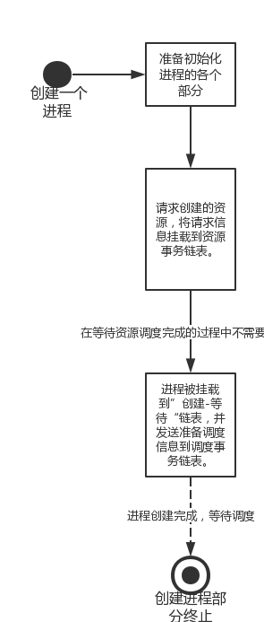

##5.3  ParalleX 进程创建

###PralleX 进程结构内容

我们之前说到进程就是知道自己现在是什么样，知道接下来自己该做什么，或是接下来怎么做，我们就这几个方面说明详细的进程结构。

####进程的基本结构

进程是调度算法的调度单位，但是对于CPU而言最小可执行实体却是线程。
最少支持运行结构：
1.用户栈（用户程序为3特权级时所使用的栈）
2.内核栈（当程序调用系统调用，程序执行进入到内核态时，则需要使用内核栈）
3.中断信息（中断发生时，保存中断相关信息）
4.属于自己的页表（线程共享整个进测的页表）
5.上下文信息（主要包括进程当前正在执行的

####进程自己的状态结构

1.进程当前的状态，其中包括六大基本状态（运行，就绪，阻塞，挂起，创建-等待，撤销-等待）。
2.进程需要的文件信息。
3.进程属于哪一个状态链表，各个状态的链表指针。

####进程执行的内容

1.进程虚拟内存管理结构。
2.进程执行映象结构。

####进程的创建过程

简单流程图：

####函数调用流程图

