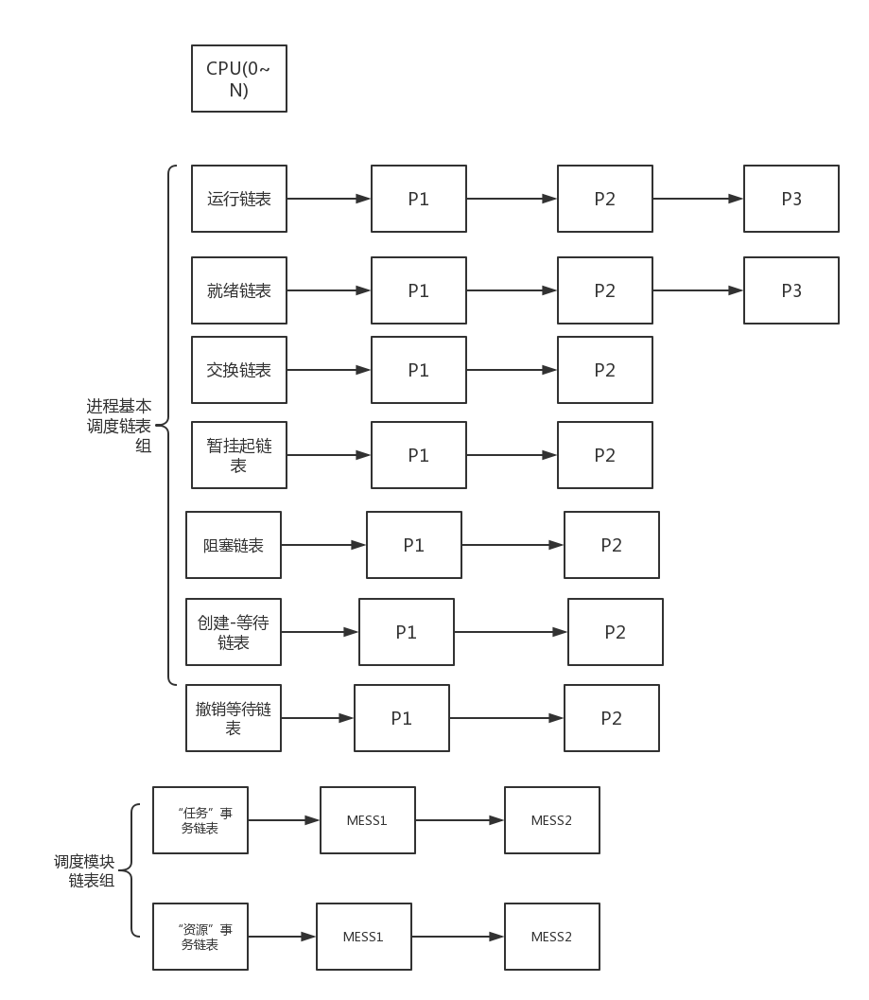

#第五章  进程管理

##5.2.0  进程定义

###5.2.1 进程是什么？

关于进程的概念，泛泛的可以说是我们布置一项计算任务给计算机，计算机执行这个任务就是一个进程的概念。
多角度的说：

从用户的角度：进程是我们执行的一个程序，是我们的一项计算任务。

从计算机的角度：进程是计算机完成的一项任务。

从程序的教角度：运行的程序才称的上是进程。

###5.2.2 本系统的进程是如何定义的？

进程的定义在各中教授操作系统的书都已经介绍的比较多了，本文档不再赘述（至少现在不会）。
首先说一点，我们的系统的接口是兼容POSIX标准的。遵守这个标准就意味着，在上层看来进程的概念并没有什么变化，宏观上看来是没有什么变化的。
进程依然完成他的本职工作帮助我们完成计算的任务。

###5.2.3 其它系统的进程特点

进程的组织与运行形式往往就反映出了一个操作系统的结构，一个操作系统的核心思想，一个操作系统的设计哲学，这么说可能有点悬。
下面我们举几个例子来看看主流OS的进程是如何组织的：

LINUX ：

WINDOWS：

SOLARIS：

FREEBSD:

###5.2.4 ParalleX进程结构

总体来说，一个进程只应该包含它所需要的所有资源。它只应当做好自己的事情，它原则上只对操作系统负责，而操作系统对用户负责。

为了完成以上“默默无闻，任劳任怨”的工作，它只需要知道自己做什么，以及现在整在做什么事，至于什么时候该做什么事则完全由操作系统来协调。这是很重要的，曾经我的一位中学老师说他对于学生最高的评价就是“知道什么时候做什么事”很遗憾，我没有获得这样的评价，我也一直认为这句话是对的，一直努力达到这个标准。操作系统总是映射着我们的生活。

言归正传，操作系统和硬件是分不开的，甚至操作系统和硬件厂商为了使操作系统和硬件的性能提升，他们都在互相接受对方的观点，为了软件与硬件的最佳结合，达到最优的效果。随着时间的发展，进程逐渐有了自己的几乎通用的结构，这里以英特尔X86系列处理器为例：

1.一个任务最少要有一个运行时属于自己的栈（内核或者用户，运行时至少有一个栈）。

2.为了任务的切换与调度，还必须有自己的上下文（一段内存空间专门用来保存寄存器）。

3.响应中断的中断栈空间（实则是一片空间，保存中断信息），一组描述自己当前状态的结构。

4.进程下来要执行的内容，这就包括页目录，页表，虚拟地址空间等。

5.实现其它扩展的部分例如线程容器等。

####为什么是这样的一个结构？
个人分析原因：

1.硬件厂商和软件厂商的意见交互，计算机最初发展之时硬件应该是占主导地位，但是随着“摩尔定律”的生效，硬件价格逐步的降低，性能提升，软件的作用就显示了出来，此时为了计算机更好的被人使用，硬件和软件逐步有了意见的交互。在后来迭代的发展后，计算机逐步发展成为了这个样子，可以说这也是对一个需要运行的进程而言最少的结构了。后来大家发现一个进程需要的资源太多，上下文
切换拷贝时消耗太大. 干脆直接打包最基本的结构称之为“线程”。

2.第二个原因是：CPU是一种时序电路（时态电路）。时序：当前状态 + 当前输入的信息。 这才是进程的思想源头，状态我们很容易表示，比如在本章第一小节说过的那几种通用状态，我们唯一需要额外做的就是扩展进程的记忆数据，（有点类似LR文法分析）。所以进程的其它资源就是为了存储进程的状态。所以从这两个原因来看，对于进程的一个最小执行结构，或者说是线程的结构创新是很难的。

###5.2.5 ParalleX进程

####进程运行环境：

如图所示：关乎全局进程调度的链表一共有两个部分，一组是存放各种状态进程的链表或哈希表，另一种是关于调度的链表组。

进测基本调度链表组：

| 名称    |   作用   |
|:------|:--------:|
|运行链表 | 距离CPU最近的链表，在此链表上的进程可以直接被调度
|就绪链表 | 作为运行链表的二级缓冲链表，主要其它状态到运行链表的一个中间状态
|阻塞链表  | 阻塞和主流方法一样最主要的就是处理IO 和 设备等待
|创建-等待链表 |当一个进程创建完成后，进程一切还没有构件完毕就会被加载到创建-等待的链表上
|撤销等待链表  |进程结束后就会被调度到这条链表，等待回收资源，但是这里还不能代表进程状态死亡

任务调度模块：

|名称    |  作用   |
|:-------|:---------:|
|任务事务链表|一切调度相关的消息，例如优先级的计算，请求调度的消息都在这条链表上
|资源事务链表|一切对于资源的请求都挂载在这条链表上，例如对于内存，设备，IO等的资源类请求都在这条链表上

