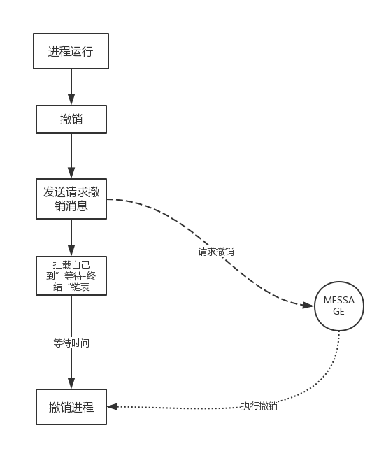

##4.5 ParalleX 进程终结

###ParalleX终结定义

进程终结: 传统的进程终结就是字面意思，进程被切换出执行队列然后就被操作系统回收资源，随后任务结束。这也是进程终结的最本质目的。但是我们的系统的进程终结，采取一个“两阶段”的过程，思想很简单，在进程需要被终结的时候，首先不直接释放资源，发送一个请求被撤销的消息，然后将他调度到“等待-终结”的一个链表上，此时他的状态就处在了一个等待被回收的状态，然后，随着时间的推移操作系统逐渐回收在这个链表上进程资源，这个过程也是一个比较快的过程。

###终结全过程

理论上来说，一个任务完成，应当快速释放它所占用的资源，这才目的。这个系统是基于消息处理的系统，一切的调度都要以消息为凭据，当一个进程需要终结时，它首先需要发送一个请求撤销的消息，然后将自己挂载到“等待-终结”的链表上，调度程序处理了请求撤销的消息后，发送一个资源回收消息到资源回收模块上，此时进程只能等待被操作系统回收资源。

流程图如下：

###这样做的目的

我们为什么要绕这么大的一个圈来终结一个进程，主要是有以下原因：

1.延时释放资源，减少频繁刷新高速缓存的动作，批量的回收有助于减少内存碎片，协调资源的分配。

2.调度本身需要遵循消息传递的规则，符合我们的设计思想。

3.收集进程执行过程的信息，为分析调度做数据收集工作。