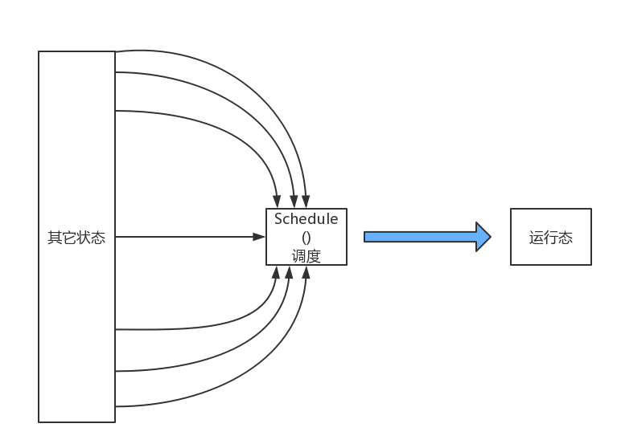

##4.4 ParalleX进程的运行

###Parallex进程的状态

说道进程的运行，我们不得不说说进程的状态，进程运行的先导条件就是进程可以运行，当前状态可以改变了，所以进程可以被调度了。简单来说，如下图：

从运行的角度来看，我们可以直接将状态划分成两个状态集合，一个是运行状态，一个是其它状态。这就回到了最初的“两状态”模型。系统在运行的过程中，对于所有的进程而言要么是运行的，要么是未运行的，所以其它状态九就自成一类，他们最终需要通过调度程序达到运行的状态。

###进程运行的几个关键点

从内核态返回用户态：

|关键点编号|内容|
|：---|：-----|
|1|使用iret指令从中断返回
|2|必须准备好进程相关的数据结构
|3|在栈中存储CS选择子
|4|栈中段寄存器的选择子必须指向DPL为3的段
|5|栈中eflags 的IF必须为1
|6|栈中eflags 的IOPL位为0
|7|TSS必须设置
|8|创建用户自己的页表项
|9|注意内存的访问标志位
|10|激活页表更新目录结构，保持特权级正确

