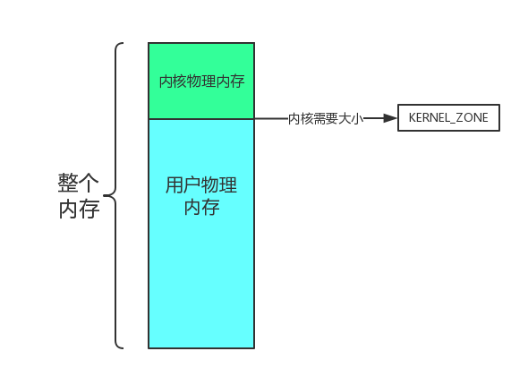
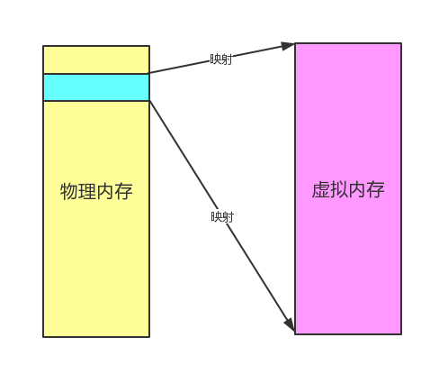

#第5章 内存管理概要

##5.x 内存管理

ParalleX的内存管理和主流操作系统一样都采用物理内存管理加虚拟内存管理的层次来组织结构。

其中我们将物理内存管理又分为内核内存管理，用户内存管理两个部分。

##5.x 物理内存管理

物理内存管理，就是实质性的管理物理内存，在此基础之上我们又分为内核物理内存管理和用户物理内存管理两个层次。

如图所示：

第一部分：内核物理内存

第二部分：用户物理内存

##5.x 虚拟内存管理

现在CPU都支持虚拟内存的使用，虚拟内存也是我们现在能运行多道程序的必要前提。

虚拟内存主要涉及MMU内存地址映射，进程虚拟地址空间的管理等内容。

