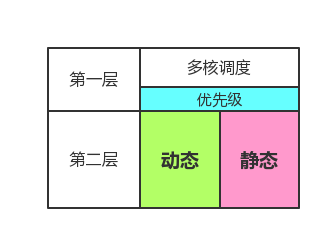

##6.2  ParalleX调度策略

###6.2.1 ParalleX的调度机制

系统的调度我们将它按照层次分成两个部分。如下图：

如图所示。本系统的调度按照层次划分可以划分为两个层次。

第一层：就是我们的调度算法，这一层的调度原理是，根据进程的优先级对进程进行调度，尤其是针对多核调度算的设计是这一层最重要的工作。
第二层：第二层的主要任务是通过动态，静态的计算来得出一个进程的优先级，我们使这个值为一个实数，用实数来刻画一个进程的优先级。

###6.2.2 几种经典的调度算法

###6.2.3 静态优先级的计算

###6.2.4 动态优先级的计算

###6.2.5 多核调度算法

###6.2.6 关于抢占

