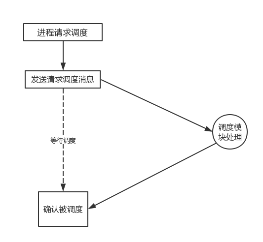

##4.1 ParalleX调度综述

###4.1.1 ParalleX调度

我们在前边已经提到，我们的操作系统调度程序以单独的调度模块为功能模块，其中调度模块不断分析调度链表上的消息，根据分析的结果做出相应的动作。

###4.1.2消息格式

对于系统使用的消息而言，我们应当统一消息的格式，并且消息格式的设计必须简洁，清晰，可扩展。我们必须考虑消息本身的性质，开销，维护等等。

###4.1.3 消息逻辑结构


    首先，我们的消息必须把问题说清楚，最简单要说明，它从哪里来到哪里去这个问题，逻辑上消息必须被设计成三个部分。
    第一部分：消息的来源。
    第二部分：消息的作用体。
    第三部分：消息的内容。

    在实际的设计过程中，我们可以按照两个部分来设计，因为最简的消息只需要告诉分析程序它需要做什么就达到目的了。对于消息是否需要写明消息的来源，其实有待考虑，我们暂且把它预留下来，以后也许有用。
    
    第一部分：消息的来源，即是消息的地址，需要写清楚自己来源于哪里。
    第二部分：消息的作用体。
    第三部分：消息的内容。
    
    
###4.1.4 消息的内容

消息类型message_type：消息被处理的的主要过程就是一个分门别类的过程，我们需要将根据消息的类型不同对消息进行处理。消息暂时一共分为以下几个类型。

|消息编号|    类型  |   作用|
|：-----|：--------|：------|
|0|调度类消息| 进程请求调度，撤销，创建等|     
|1|资源分配类消息|对于内存，网络，磁盘等资源的请求|
|2|通信消息|进程之间可以使用消息进行通信|


###4.1.5 消息的具体结构

```
typedef strcut Message{

    unsigned long message_length;   /*消息长度*/
    unsigned long * from;           /*消息来源*/
    unsigned long * to  ;           /*消息作用体*/
    
    int TYPE;                       /*消息类型，作为消息的最根本类型*/
    ini ACTIVE_TYPE;                /*消息动作类型，作为消息的动作标记*/
    
    char *opt;                      /*其它信息，不同消息处理方式不同*/
    

};

```

###4.1.6 不同消息的类型

消息内容message_data:消息被分类后就需要按照具体的功能来进行处理了，所以对于不同的类型的内容需要有不同的解读规则。

调度类消息分类：

|编号 |动作|标记| 可能需要参数涵义
|：---|：-------|：-----|：------|
|1|进程请求被调度|RUNING|num:优先级
|2|进程请求被撤销|DONE|num:优先级
|3|进程请求挂起/阻塞|HUNG|num:优先级
|4|进程请求创建|CREATE|num:优先级
|5|进程请求交换|SWAP|num:优先级

资源类分配类消息分类：

|编号|动作|标记|可能需要参数|
|:-----|:-------|:--------|:--------|
|1|请求内存资源|ALLOC_MEM|flag:标记，num:大小|
|2|请求IO资源|ALLOC_IO|flag:标记，num:地址|
|3|请求网络资源|ALLOC_NET|flag:标记，num:地址|
|4|请求通信资源|ALLOC_PIC|flag:标记，其它相关信息|


###4.1.7 进程请求调度流程图



