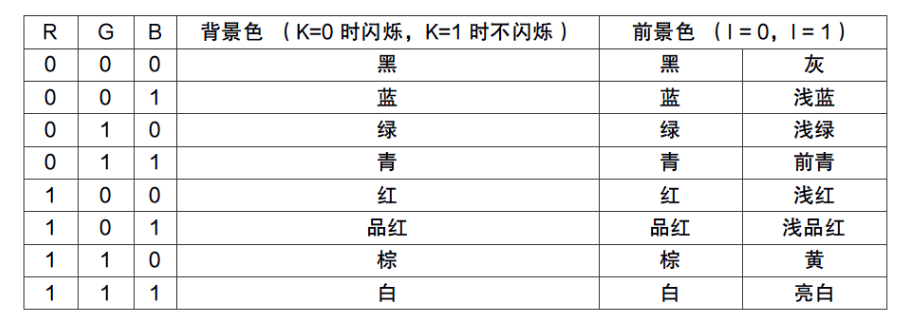

#7.1基本显示

基本显示指的是内核对屏幕输出的基本显示,也就是用于人机交流中最初始的一步.
	
而我们在向屏幕上输出文本时,要么利用BIOS中断,要么利用系统调用,而这些都是依赖别人的方法.我们要写操作系统,当然不能使用别人写好的这些东西了.所以我们需要去自行实现一个打印函数了.
	
对于计算机来说,4G的地址空间并非全部指向主存储器，而是有部分的地址分给了其他外设。

而在地址空间的最低1MB处,就有很多的地址是属于外部设备的.在PC上要显示文字，通常需要显示器和显卡这两个硬件设备。一般来说显卡负责提供显示内容，并控制具体的显示模块和状态。显示器的职责是负责将显卡呈递的内容可视化的显示出来。既然显卡需要控制显示的数据，自然就需要存储这些待显示的内容，所以显卡就有自己的存储区域。这个存储区域叫做显示存储器（Video RAM，VRAM），简称显存。当然，访问显存就需要地址。CGA/EGA+ Chroma text video buffer 这个区域映射的就是工作在文本模式的显存。同时显卡还有另外一个工作模式叫做图形模式，这个模式是目前最最常用的模式。


###显示在文本模式下的显示规则
我们知道，对于一个字符的编码通常有输入码、内码和字模码三种。其中字模码定义了一个字符在屏幕上显示的点阵坐标。因为一旦使用了图形模式的内容，我们就需要自行定义字符的字模码了，这很繁琐而且对我们理解操作系统原理的意义不是很大。所以我们只使用显卡的文本模式进行屏幕显示控制。所有在PC上工作的显卡，在加电初始化之后都会自动初始化到80*25的文本模式。

在这个模式下，屏幕被划分为25行，每行可以显示80个字符，所以一屏可以显示2000个字符。上图中的0xB8000～0xBFFFF这个地址段便是映射到文本模式的显存的。当访问这些地址的时候，实际上读写的是显存区域，而显卡会周期性的读取这里的数据，并且把它们按顺序显示在屏幕上。

那么，按照什么规则显示呢？这就要谈到内码了。内码定义了字符在内存中存储的形式，而英文编码就是大家所熟知的ASCII（American Standard Code for Information Interchange，美国信息交换标准代码）码了。对应的关系很简单，从0xB8000这个地址开始，每2个字节表示屏幕上显示的一个字符。从屏幕的第一行开始对应，一行接着一行的对应下去。而这两个字节的前一个是显示字符的ASCII码，后一个是控制这个字符颜色和属性的控制信息，这个字节的8个bit位表示不同的含义。每一位的含义如图所示：


这些位的组合效果如下图所示：



这两张图可以帮助我们在显卡的字符模式显示彩色的文本了，懂得这些原理对于探索性质的显示也就足够了。

理解了显卡文本模式的原理之后接下来就是对屏幕显示控制编码了。不过显卡除了显示内容的存储单元之外，还有部分的显示控制单元需要了解。这些显示控制单元被编制在了独立的I/O空间里，需要用特殊的in/out指令去读写。这里相关的控制寄存器多达300多个，显然无法一一映射到I/O端口的地址空间。对此工程师们解决方案是，将一个端口作为内部寄存器的索引：0x3D4，再通过0x3D5端口来设置相应寄存器的值。

###端口读写函数的实现

在具体的设置之前，我们首先需要几个端口读写函数的实现。因为C语言并没有直接操作端口的方法，而且频繁的内联汇编麻烦又容易出错。所以好的做法就是定义几个端口读写函数。

eg:
```
// 端口写一个字节
inline void outb(uint16_t port, uint8_t value)
{
    asm volatile ("outb %1, %0" : : "dN" (port), "a" (value));
}
```
在这里我们使用inline语句,编译器会尝试在该函数的调用点进行直接进行代码展开，而不是传统的函数调用。这么做的既有传统函数的好处，即避免了重复性的编码，减少了出错的几率。又减少了函数的调用，提高了代码的执行效率。另外，你可能见过宏函数这种用法，但是宏函数是没有参数类型的检查的，相比inline还是逊了一筹。

###颜色的枚举定义和屏幕操作函数的实现

在颜色的枚举定义方面,我们参照着前面的表格，理解颜色的枚举类型并不困难。

至于屏幕操作函数的实现，首先我们要考虑的是输出的位置，当然，这也就是光标出现的原因了。首先,为了确定光标的位置，我们需要定义横，纵坐标。但是对于计算机而言我们只是定义了两个整形变量而已，如何让计算机理解我们需要的时光标的横纵坐标呢。这就需要我们"告诉"计算机，这是我们需要将光标移动在哪个位置。

VGA显卡内部有一系列寄存器用来控制显卡的状态。而对应的0x3D4和0x3D5两个端口可以用来读写显卡内部的寄存器。需要先对端口0x3D4写入要访问的寄存器编号，其次向0x3D5端口写入数据。若需要存放光标的高位信息则需要访问的寄存器编号为14，若存放光标低位信息则需要访问的寄存器编号为15。

已经可以确定我们需要现实的位置了，接下来,我们就讨论如何让屏幕显示指定的数据了。其实在前面已经讲的比较清楚了，我们首先已经确定了显卡的内存地址，只要将要输入的数据和数据的颜色确定了，写进去就好了，但是注意在写数据的过程中,需要考虑特殊的情况，比如输出的值中有换行键，退格键一类,需要特殊处理。写满后我们需要上棍同时一定要注意修改存储当前位置的两个变量和移动屏幕上的光标，而且屏幕输出满了以后要上滚。上滚的实现实际上就是将后24行的数据全部向上挪动一行，最后一行清空罢了。

###C语言的字符串处理

我们之前多次提到现有的用户态的C语言标准库无法使用在内核中，但是内核开发中难免要用到诸如字符串操作的函数，所以我们需要自己实现这些字符串相关的函数。

||||
|:---|:--|
|函数名|功能|
|void *memcpy(void *dest, const void *src, size_t n);|从源src所指的内存地址的起始位置开始拷贝n个字节到目标dest所指的内存地址的起始位置中|
|...|...|

###内核级的打印函数

我们通过调用前面屏幕操作函数的实现，仿照C语言中的printf函数写了我们自己的内核级打印函数。
